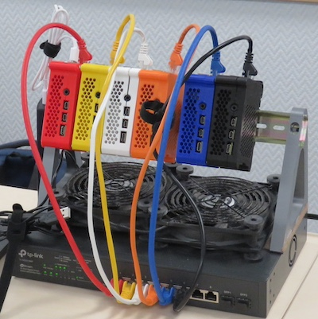

# CW24 Build miniHPC
The initial part of this work was undertaken at the [Software Sustainability Institute](https://www.software.ac.uk) (SSI) [Collaboration Workshop 24](https://www.software.ac.uk/workshop/collaborations-workshop-2024-cw24) (CW24) hack day.

The aim of this work is to document and automate the process of building and configuring a 'min HPC cluster' (shown below) based on Rasberry PIs to facilitate the delivery of training and outreach. 

In detail, are objectives are to:

* Improve the documentation of the steps needed to set up the cluster, building on [hpc-intro](https://carpentriesoffline.org/miniHPC). 
* Create a script that will automate the setup process. This will be a new work to be begun during the hack day.
* Test the existing Carpentries [HPC intro lesson](https://carpentries-incubator.github.io/hpc-intro/) on this system.
* Draft instructor documentation to allow the delivery of this lesson.
  
The project is built on previous work developing the hardware setup and on manual configuration of the cluster. Prior to this hack the setup procedure was informally documented and the system had not been tested with lesson material.
