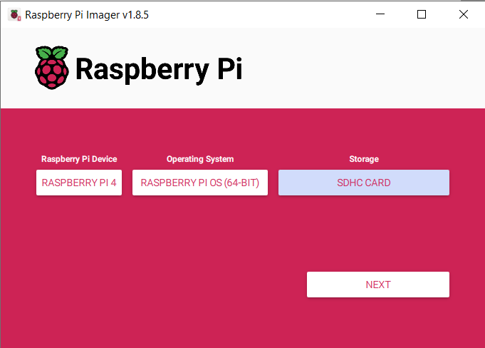
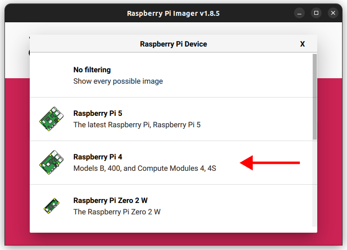
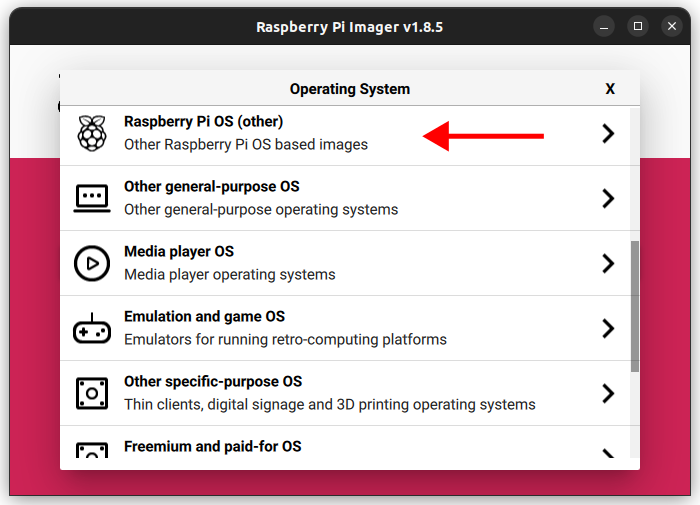
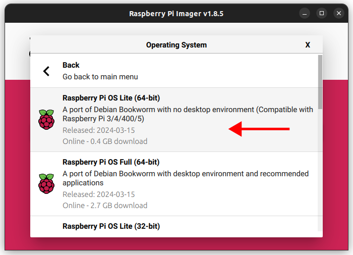
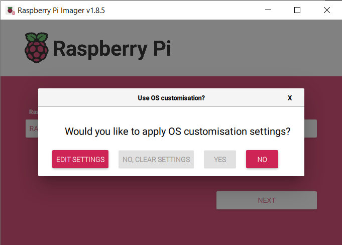
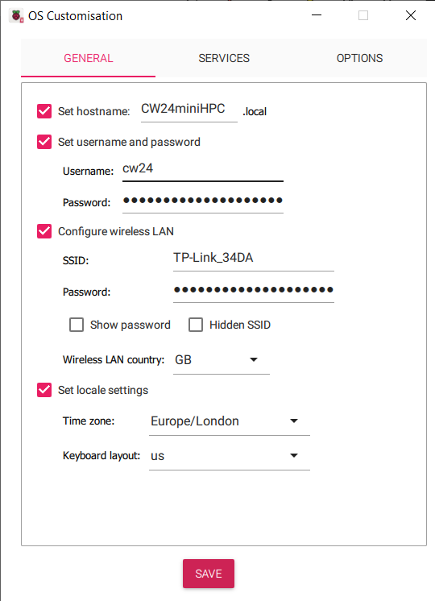
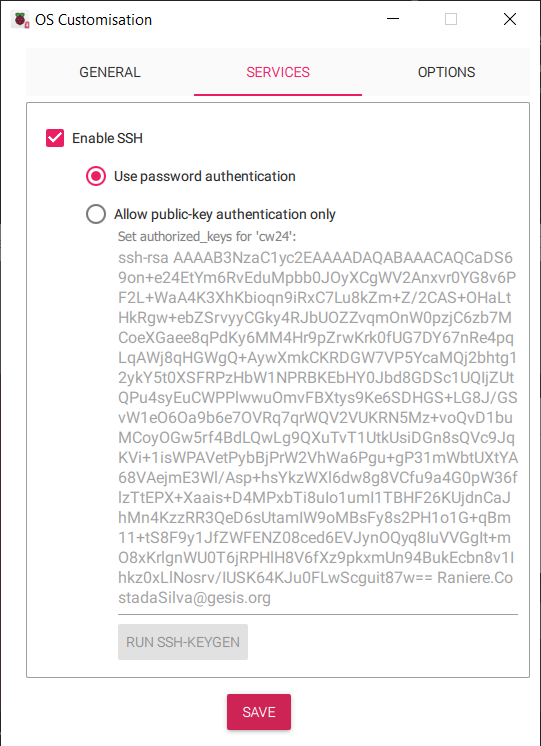
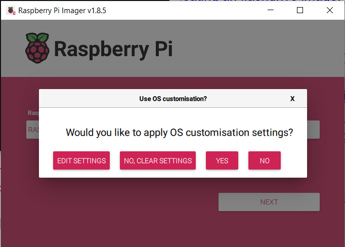

# 1. Hardware requirement 

## Minimal requirements
- Raspberry Pi (RPi) 4 2GB+ single board computers (SBC): 1 for the head node, plus as many nodes as as you want
- A multiport Netgear switch (as many ports as Rasberry Pis)
- 10BaseT Cat6 ethernet cables (1 per Rasberry Pi)
- Power supplies for each Rasberry Pi (alternatively: use a PoE switch to power all Rasberry Pis)
- A 8GB flash drive for shared storage
- A 32GB SD card to boot the main node from
- Cooling device (e.g. USB desktop fan)
 
## Optional
- Example of casing:
  - 3D printed DIN Rail stand
  - 3D printed RPi cases

# 2. Initial configuration
_TODO From https://github.com/carpentriesoffline/CarpentriesOffline.github.io/blob/main/rpiimage_step_by_step.md_

## Creating an SD card image: step-by-step

###  Setting up a Raspberry Pi

The official [Set up your SD card](https://projects.raspberrypi.org/en/projects/raspberry-pi-setting-up/2) is up to date as of 2nd of May 2024.

When using the The Raspberry Pi Imager, select the Device and OS.

The OS selection should be `Raspberry Pi OS (other)` -> `Raspberry Pi OS Lite (64-bit)`.



Selecting the device:




Selecting the OS:





it will ask if the user wants to do any customisation, select `EDIT SETTINGS`.



This will show a pop-up window where the following configuration options can be defined for your set-up (below are examples) such that your OS is pre-configured upon first boot.

1. Hostname: `CW24miniHPC`
1. Username: `cw24`
1. Password: `*****`
1. WiFI SSID and Password: Enter your WiFi details



and enable SSH with password authentication (alternatively, adding a ssh public key). If you would like to set up easy access to the Pi via an ssh key, please see [here](ssh-setup.md).

_TODO: Section on generating an ssh key-pair._




After, saving this, select `YES` to apply the configuration.



### Setup for headless config (useful if you don't have a screen and keyboard to hand) -> TODO
* In the boot (small FAT32) partition on the SD card create an empty file called "ssh"
* If you're using WiFi to get access to the Pi, create a file called wpa_supplicant.conf in the boot partition. Paste in the following and set your network SSID and password appropriately.

```
#set this to your country code, gb=great britain
country=gb
update_config=1
ctrl_interface=/var/run/wpa_supplicant

network={
 scan_ssid=1
 ssid="my_networks_ssid"
 psk="my_networks_password"
}
```

#### Login to the Pi
Use SSH or login with a local console if you have a monitor attached.

#### Run the install script
* Login to your Raspberry Pi with an SSH client or on a local screen/keyboard and run the command:
* ```curl https://raw.githubusercontent.com/carpentriesoffline/carpentriesoffline-installer/main/setup.sh > setup.sh && bash ./setup.sh```

#### Change the password
* Run the `passwd` command. Leaving the default password will mean anybody in your workshop can login to your Pi and change settings on it.

#### Connect to Carpentries Offline
* After installing the Raspberry Pi will reboot.
* It will then switch the WiFi interface to access point mode and will be available as a network called carpentries-offline.
* Connect to the carpentries-offline WiFi network
* Visting [http://carpentriesoffline.org](http://carpentries.org) or [http://192.168.1.1](http://192.168.1.1)
* You should get links to the Carpentries Lessons and the Gitea server on the Raspberry Pi

#### Using PyPi and CRAN mirrors from your Pi
* These are downloaded to the Pi and placed in [http://192.168.1.1/pypi](http://192.168.1.1/pypi) and [http://192.168.1.1/miniCRAN](http://192.168.1.1/miniCRAN).
* You will need to update your settings to use these locations. (TODO: write instructions on how to do this)


# Installing SLURM/HPC
