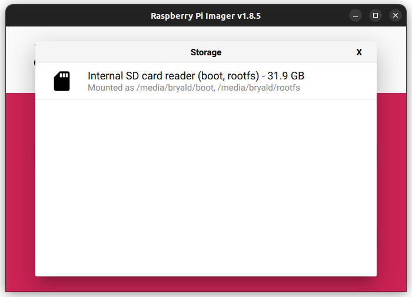
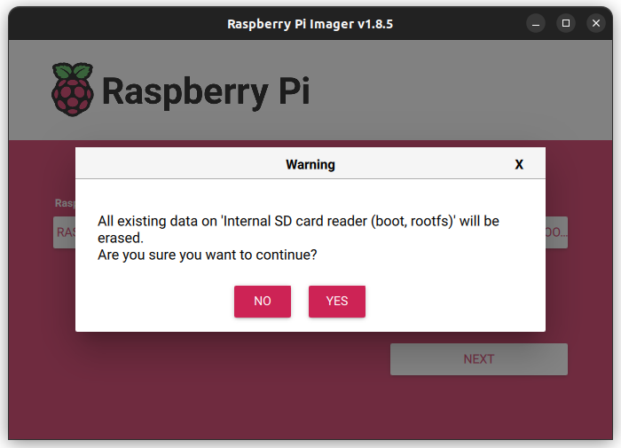

This is a step by step guide on how to set up a miniHPC using Raspberry Pis.

# 1. Hardware requirement 

## Minimal requirements
- Raspberry Pi (RPi) 4 2GB+ single board computers (SBC): 1 for the head node, plus as many nodes as as you want
- A multiport Netgear switch (as many ports as Rasberry Pis)
- 10BaseT Cat6 ethernet cables (1 per Rasberry Pi)
- Power supplies for each Rasberry Pi (alternatively: use a PoE switch to power all Rasberry Pis)
- A 8GB flash drive for shared storage
- A 32GB SD card to boot the main node from
- Cooling device (e.g. USB desktop fan)
 
## Optional
- Example of casing:
  - 3D printed DIN Rail stand
  - 3D printed RPi cases

# 2. Initial configuration
_TODO From https://github.com/carpentriesoffline/CarpentriesOffline.github.io/blob/main/rpiimage_step_by_step.md_

## Creating an SD card image: step-by-step

###  Setting up a Raspberry Pi

The official [Set up your SD card](https://projects.raspberrypi.org/en/projects/raspberry-pi-setting-up/2) is up to date as of 2nd of May 2024.

When using the The Raspberry Pi Imager, select the Device and OS.

The OS selection should be `Raspberry Pi OS (other)` -> `Raspberry Pi OS Lite (64-bit)`.


Selecting the device:


Selecting the OS:


After this, please select the sdcard you would like to flash the image on, Then press `NEXT`.



it will ask if the user wants to do any customisation, select `EDIT SETTINGS`.


This will show a pop-up window where the following configuration options can be defined for your set-up (below are examples) such that your OS is pre-configured upon first boot.

1. Hostname: `CW24miniHPC`
1. Username: `cw24`
1. Password: `*****`
1. WiFI SSID and Password: Enter your WiFi details


and enable SSH with password authentication (alternatively, adding a ssh public key). If you would like to set up easy access to the Pi via an ssh key, please see [here](ssh-setup.md).

_TODO: Section on generating an ssh key-pair._


After, saving this, select `YES` to apply the configuration.


Confim writing to the sdcard (please backup any data on the sdcard, any existing data will be **LOST!**)



# Installing SLURM/HPC

## Setting up the miniHPC login node

- Login to the Pi
Use SSH or login with a local console if you have a monitor attached. Use the login details you used above to log into the Pi.

```bash
ssh <USERNAME>@<IP-ADDRESS>
```

In this example, the username would be `cw24`

- Do an update and a full-upgrade:

```bash
sudo apt update
sudo apt full-upgrade
```

- Install required dependencies.

```bash
sudo apt install -y nfs-kernel-server lmod ansible slurm munge nmap \
nfs-common net-tools build-essential htop net-tools screen vim python3-pip \
dnsmasq slurm-wlm
```

- Setup the Cluster network

Place the following into `/etc/network/interfaces`

```bash
auto eth0
allow-hotplug eth0
iface eth0 inet static
  address 192.168.5.101
  netmask 255.255.255.0
source /etc/network/interfaces.d/*
```

- Modify the hostname

```bash
echo pixie001 | sudo tee /etc/hostname
```

- Configure dhcp by entering the following in the file `/etc/dhcpd.conf`

```bash
interface eth0
static ip_address=192.168.0.1/24
static routers=192.168.0.1
static domain_name_servers=192.168.0.1
```

- Configure dnsmasq by entering the following in the file `/etc/dnsmasq.conf`

```bash
interface=eth0
bind-dynamic
domain-needed
bogus-priv
dhcp-range=192.168.0.1,192.168.0.100,255.255.255.0,12h
```

- Configure shared drives by adding the following at the end of the file `/etc/exports`

```bash
/sharedfs    192.168.0.0/24(rw,sync,no_root_squash,no_subtree_check)
/modules     192.168.0.0/24(rw,sync,no_root_squash,no_subtree_check)
```

- The `/etc/hosts` file should contain the following:

```bash
127.0.0.1	localhost
::1		localhost ip6-localhost ip6-loopback
ff02::1		ip6-allnodes
ff02::2		ip6-allrouters

# This login node's hostname
127.0.1.1	pixie001

# IP and hostname of compute nodes
192.168.0.2	pixie002
192.168.0.3	pixie003
192.168.0.4	pixie004
192.168.0.5	pixie005
```


- Install ESSI

```bash
mkdir essi
cd essi
wget https://raw.githubusercontent.com/EESSI/eessi-demo/main/scripts/install_cvmfs_eessi.sh
sudo bash ./install_cvmfs_eessi.sh
echo "source /cvmfs/software.eessi.io/versions/2023.06/init/bash" | sudo tee -a /etc/profile
```

- Create a shared directory.

```bash
sudo mkdir /sharedfs
sudo chown nobody.nogroup -R /sharedfs
sudo chmod 777 -R /sharedfs
```
